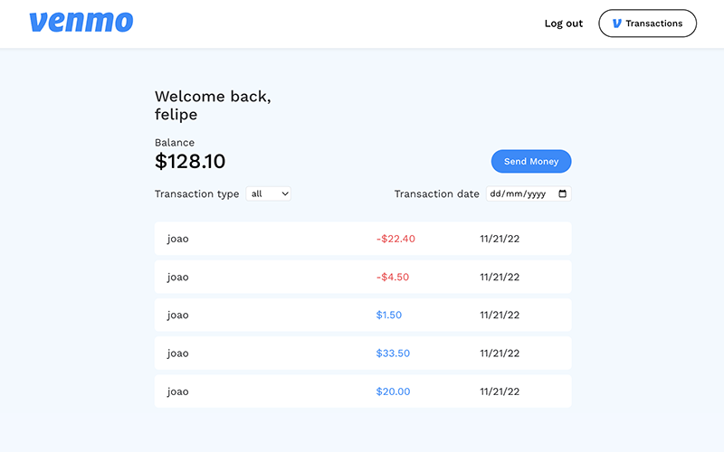
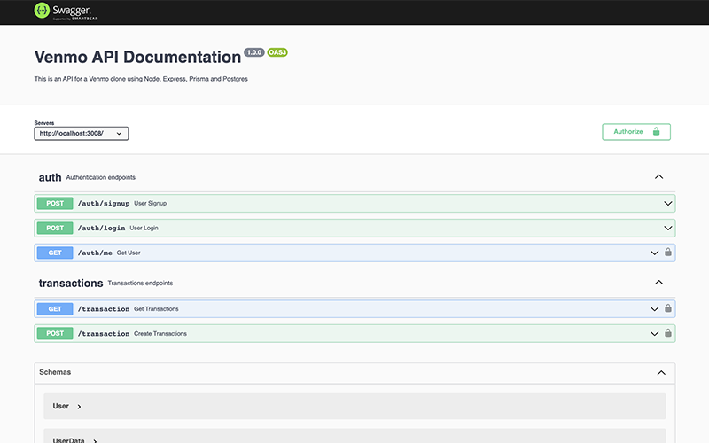
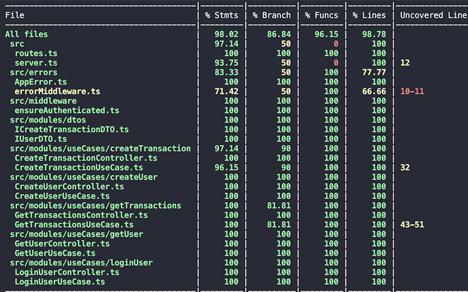

# Venmo Cash APP

Fast, safe, social payments. Pay. Get paid. Shop. Share. Join tens of millions of people on Venmo.

- Frontend: Built with React, Typescript, Vite, Styled Components, React Hook Form and React Query
- Backend: Built with Node, Express, Prisma, Typescript, Postgress, Docker and Swagger UI
- Server integration tests with Mocha and ChaiHTTP.

To run locally clone the repository and run:
<br>

```
$ docker-compose up -d
```

You can open the application and the API docs on:
<br>

```
$ Application: http://localhost:3000
$ API docs: http://localhost:3008/api-docs
```

To run the backend coverage tests use the commands:
<br>

```
$ docker exec -it backend /bin/sh
$ npm run test:coverage
```

<br>




