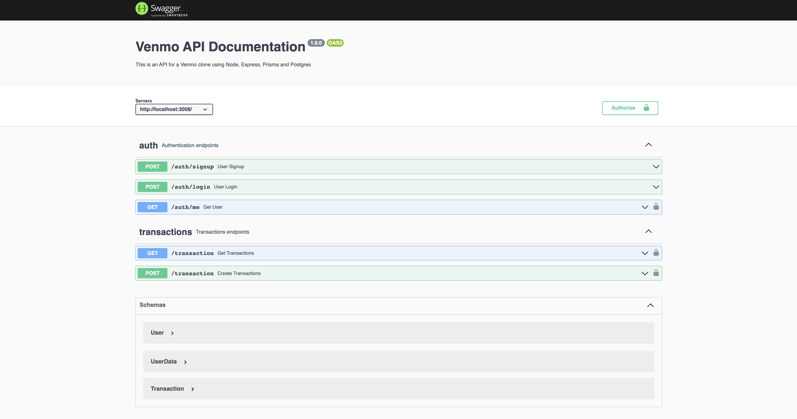
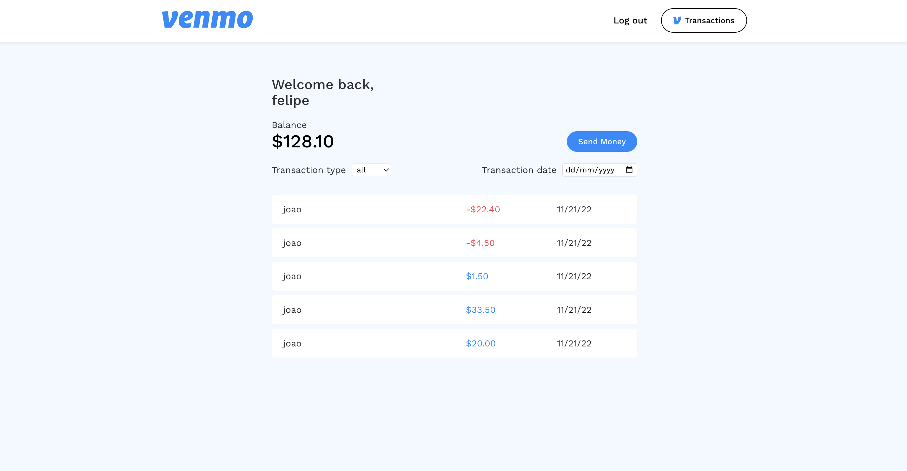

# Venmo Cash APP

Fast, safe, social payments. Pay. Get paid. Shop. Share. Join tens of millions of people on Venmo.

  - Frontend: Built with React, Typescript, Vite, Styled Components, React Hook Form and React Query
  - Backend: Built with Node, Express, Prisma, Typescript, Postgress, Docker and Swagger UI
  - 80%+ test coverage with Mocha, ChaiHTTP, and Sinnon
  
To run locally clone the repository and run the following commands:
<br>

```
$ docker-compose up -d
$ docker exec -it backend /bin/sh
$ npm run migration
```

You can open the application and the api docs on this URLs:
<br>
```
$ application: http://localhost:3000/ 
$ api docs: http://localhost:3008/api-docs/
```

<br>
<br>




